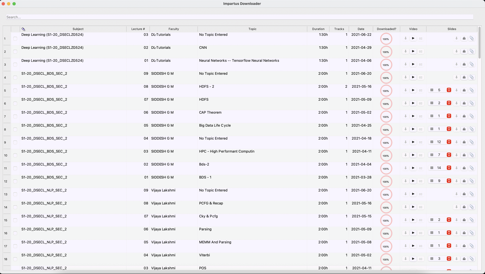

Impartus Downloader
===

Downloader for impartus streaming videos.

- Convert impartus lectures to mkv files.
- Regular and flipped lecture download supported.
- Tested on Mac OSX, Linux (ubuntu) and Windows 10.
- Parallel downloads supported. 
- Supports multi-track files. Tested with video lectures having up to 4 tracks.
- Backpack slides download supported.
- Lecture chats overlayed as closed captions for the video.
- Pause / Resume individual downloads.
- Editable subject field to use shorter subject names and better organize the folders.
- Auto Organize lectures to match any change in lecture topic, subject. 
- Attach slides downloaded from external sources to the lecture folder.
- Sortable content.
- Customizable color schemes, fonts.
- Configurable columns.

- [new] Qt5 bsed ui.
- [new] System theme supported
- [new] offline workflow to access lectures, slides without logging in.
- [new] Content search.
- [new] Better, responsive user experience.

---

### UI

### Demo video
[TBA]
---

## Installation / Run

Ensure python version is >= 3.6

#### Setup virtualenv (optional)
>	$ virtualenv venv
>
>	$ source venv/bin/activate 

#### Clone repo
>	$ git clone https://github.com/paljsingh/impartus-downloader.git
>
>	$ cd impartus-downloader

#### Install dependencies

- OSX, Linux

>  
>	$ pip3 install -r requirements.txt
>

- Windows

>  
>	$ pip3.exe install -r requirements.txt
>

#### Install ffmpeg

- OSX
>
> $ brew install ffmpeg
> 

- Linux (Ubuntu)
>
> $ sudo apt-get install ffmpeg
> 

- Windows
> Download the win64-gpl zip from the following link, extract and copy ffmpeg.exe to
>  impartus-downloader folder. The ffmpeg.exe statically bundles the dependent libs and
> should be about 90 MB in size.
> 
> [https://github.com/BtbN/FFmpeg-Builds/releases](https://github.com/BtbN/FFmpeg-Builds/releases)
>

#### Run application

- OSX, Linux
>
> $ python3 App.py
>

- Windows
>
> $ python.exe App.py
>

## Configuration

see etc/impartus.conf

## Unit Tests

>
> $ python3 -m pytest -v test
>

---

## Todo
* Option to download auto-generated slides.
* Add metadata tags to slides to preserve mapping across lecture topic / video rename.
* Improve fuzzy matching of videos to slides by making use of slide name and content.

---

## Known Issues
**Incorrect lecture slide associated to a video**

> The impartus platform does not offer a strict video to lecture slides mapping, the application uses the upload dates of the two for a fuzzy match. 
> 
> You may try changing (decreasing) the value of `slides_upload_window` value in `etc/impartus.conf`, which may work better in case you have more than one lectures for a subject within a week's duration.
>
---

**Connection issues when downloading**
>
> Impartus site may start throttling the connections if there are too many parallel downloads. The application uses retry logic with induced delay. However, if the issue persists you may need to restart the app.
> 
---

**Application crashes on Linux**

> On some systems the application crashes with error:
> `X Error of failed request:  BadLength (poly request too large or internal Xlib length error)`
>
> The issue is caused by a bug in libXft and can be resolved by uninstalling `fonts-noto-color-emoji`
>
>  `$ sudo apt-get remove fonts-noto-color-emoji`
>
---

**Hard to read closed captions on white background**
> 
> With VLC, you can set the background opacity value to 255.
> 
>  Go to Preferences.
> 
>  Select 'All' settings
> 
>  Navigate to Video > Subtitle / OSD > Text renderer   
> 
>  Change 'Background Opacity' to 255
> 
>  Save and restart VLC.
> 

>
> Below is a sample output of the opacity change.
>

>  
---

Drop a mail to paljsingh@gmail.com in case of any issues/errors.
