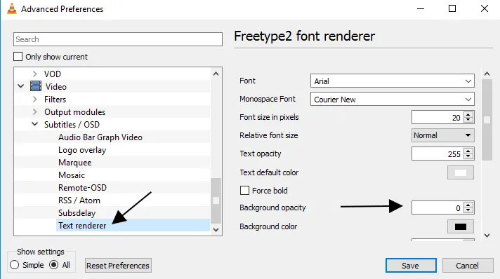
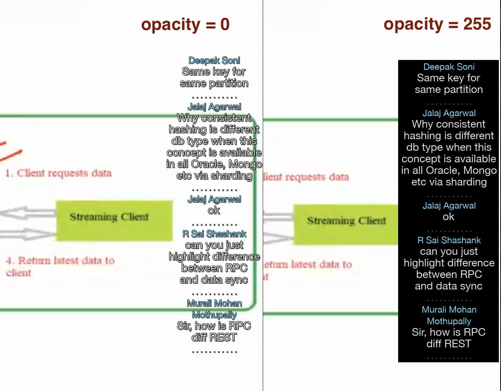

  


Impartus Downloader (Desktop App)
===

***For Android version - click***
https://github.com/paljsingh/Impartus-Downloader-Android

---


Downloader for impartus streaming videos.
---

- Tested on Mac OSX, Linux (ubuntu) and Windows 10.

Feature list

- Convert impartus lectures to mkv files.
- Regular and flipped lecture download supported.
- Supports multi-track files. Tested with video lectures having up to 4 tracks.
- Backpack slides download supported.
- Lecture chats overlayed as closed captions for the video.
- A command line interface.


---

### UI
Videos


Documents


### Demo video
[TBA]
---

## Prerequisites

python >= v3.7
ffmpeg >= v4.3

## Installation / Run

OSX (10.14+)
>   ```
> # setup virtualenv (optional)
> $ virtualenv venv
> $ source venv/bin/activate 
>
> # clone repo
> $ git clone https://github.com/paljsingh/impartus-downloader.git
> $ cd impartus-downloader
>
> # install dependencies
> $ pip3 install -r requirements.txt
> $ brew install ffmpeg
> 
> # Ensure ffmpeg version is >= 4.3.0
> $ ffmpeg -version 
>
> # Run application
> $ python3 App.py
> ```

Windows 10
>```
> The following steps shall work on Windows CMD prompt.
>
> # clone repo
> git.exe clone https://github.com/paljsingh/impartus-downloader.git
> cd impartus-downloader
> 
> # setup virtualenv (optional, but recommended if you have Anaconda installed on the system)
> pip.exe install virtualenv
> virtualenv venv
> call .\venv\Scripts\activate.bat
> 
> # install dependencies
> pip.exe install -r requirements.txt
>
> Download win64-gpl zip from the following link, extract and copy ffmpeg.exe to
> impartus-downloader folder. The ffmpeg.exe statically bundles the dependent libs and
> should be about 90 MB in size.
> https://github.com/BtbN/FFmpeg-Builds/releases/download/latest/ffmpeg-master-latest-win64-gpl.zip
> 
> # Ensure ffmpeg version is >= 4.3.0
> ffmpeg.exe -version 
>
> # Run application
> python.exe App.py
> ```

Linux (Ubuntu 20+)
>```
> # setup virtualenv (optional)
> $ virtualenv venv
> $ source venv/bin/activate 
>
> # clone repo
> $ git clone https://github.com/paljsingh/impartus-downloader.git
> $ cd impartus-downloader
>
> # install dependencies
> $ pip3 install -r requirements.txt
> $ sudo apt-get install ffmpeg
>
> # Ensure ffmpeg version is >= 4.3.0
> $ ffmpeg -version 
>
> # Run application
> $ python3 App.py
> ```

## Command Line
>```
>
> export IMPARTUS_USER='user@domain'
> export IMPARTUS_PASS='password'
> 
> # login to impartus
> $ python3 app-cli.py login
> 
> $ export IMPARTUS_TOKEN='token.from.login-command'
> 
> # save json info of subscribed subjects under json/subjects/
> $ python3 app-cli.py subjects -o json/subjects/
> 
> # save lectures info for subject-1 under json/subject-1/lectures/
> $ python3 app-cli.py lectures -j json/subjects/subject-1.json -o json/subject-1/lectures/
> 
> # save backpack documents info for subject-1 under json/subject-1/documents/
> $ python3 app-cli.py documents -j json/subjects/subject-1.json -o json/subject-1/documents/
> 
> # download video for subject-1 / lecture-1, save it under data/videos/
> $ python3 app-cli.py download video -j json/subject-1/lectures/lecture-1.json -o data/videos/
> 
> # download lecture chats for subject-1 / lecture-1, save it under data/videos/
> $ python3 app-cli.py download chat -j json/subject-1/lectures/lecture-1.json -o data/videos/
> 
> # download backpack document for subject-1 / document-1, save it under data/documents/
> $ python3 app-cli.py download document -j json/subject-1/documents/document-1.json -o data/documents/
> 
>```


## Configuration

see etc/impartus.conf


## Unit Tests

> FIXME:
> 
> $ python3 -m pytest -v test
>

---

## Known Issues

**Hard to read closed captions on white background**
> 
> With VLC, you can set the background opacity value to 255.
> 
>  Go to Preferences.
> 
>  Select 'All' settings
> 
>  Navigate to Video > Subtitle / OSD > Text renderer   
> 
>  Change 'Background Opacity' to 255
> 
>  Save and restart VLC.
> 
> 
>
> Below is a sample output of the opacity change.
>
> 
> 
---

**System theme settings not picked up on Linux**

On linux, PySide2 must be installed as system-wide package to access the currently selected theme settings.
A pip based installation falls back to Fusion theme, and won't pick up the run time changes in the theme settings.

Steps needed in order to use system theme settings on linux.

remove pip Pyside2 installation:
```
$ pip3 uninstall PySide2
```

also remove any system wide Pyside2 pip install
```
$ sudo pip3 uninstall PySide2
```

Qt5ct is not needed, so just ensure the current envrionment does NOT have the Qt5ct variable
```
$ env | grep QT_QPA_PLATFORMTHEME
```
The above command should show empty result.

Install PySide2 and dependent components as system wide package.

```
$ sudo apt-get install python3-pyside2.qtuitools python3-pyside2.qtwidgets libpyside2-py3-5.14
```

Ensure to use PySide2 api, in case there also exists a Qt5/Qt4 installation,
```
$ echo 'export QT_API=PySide2' >> ~/.bashrc 
$ source ~/.bashrc
$ python3 App.py
```
alternatively, one can run the app as:
```
$ QT_API=PySide2 python3 App.py
```

Ref: [PySimpleGUI/PySimpleGUI#2437](https://github.com/PySimpleGUI/PySimpleGUI/issues/2437)


---

**Error on application launch - "No module named Crypto"**

The error may appear if 'crypto' package is installed on the system.
crpyto is deperecated and no longer recommended due to various security issues.  
Impartus application uses 'pycryptodome' that may conflict with 'crypto' package as they both provide the functions under 'Crypto' namespace.

To resolve the issue, uninstall crypto, then reinstall pycryptodome:
>
> $ pip3 uninstall crypto  
> $ pip3 uninstall pycryptodome  
> $ pip3 install pycryptodome  

---

**Error on application launch - "ImportError: DLL load failed: The specified procedure could not be found."**

On windows, this error may appear due to incompatibility between the PySide2 and python versions.
Upgrading to python version 3.7 or above should resolve the issue.

You may also need to upgrade your pip version, in case
pip3 list
output shows PySide2 version other than 5.15.2

$ pip3 install --upgrade pip

If you still see the issue, you may try upgrading python version, at present the following
python / windows version seem to have compatibility issues with PySide2 v5.15.2

Python v3.7.3, Windows 8.1    -   https://bugreports.qt.io/browse/PYSIDE-1002

Python v3.9.0, Windows PE     -   https://bugreports.qt.io/browse/PYSIDE-1479

---

Drop a mail to paljsingh@gmail.com in case of any issues/errors.
