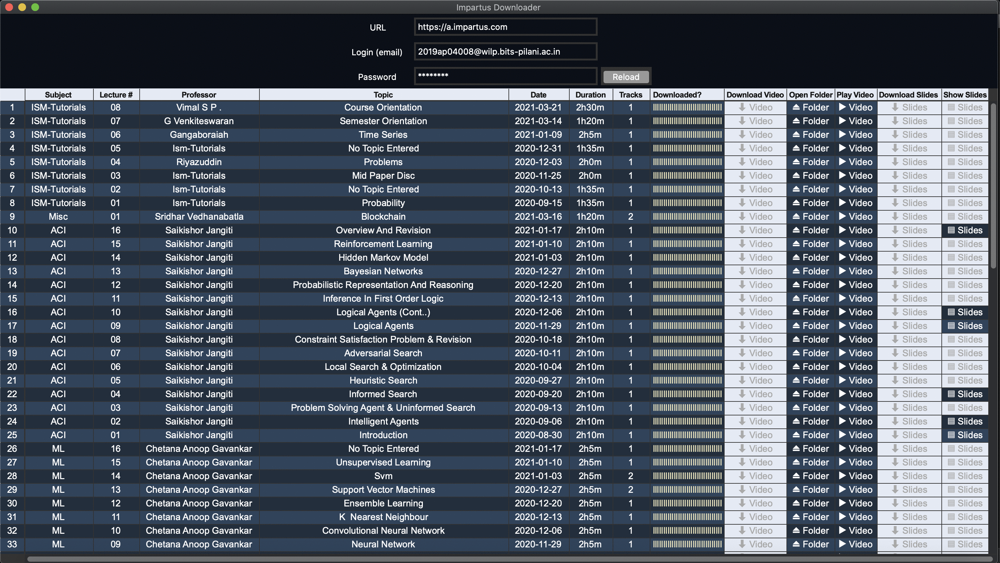

Impartus Downloader
===

Downloader for impartus streaming videos.

- Convert impartus lectures to mkv files.
- Download Lecture slides.
- Multi view/track files supported. Tested with files up to 4 tracks.
- Parallel downloads supported. 
- Tested on Mac, Linux (ubuntu) and Windows 10.
- Sortable content.
- Customizable color schemes, fonts.

___

### UI

### Demo video

## Installation / Run

#### Setup virtualenv (optional)
>	$ virtualenv venv
>
>	$ source venv/bin/activate 

#### Clone repo
>	$ git clone https://github.com/paljsingh/impartus-downloader.git
>
>	$ cd impartus-downloader

#### Install dependencies

- OSX, Linux

>  
>	$ pip3 install -r requirements.txt
>

- Windows

>  
>	$ pip3.exe install -r requirements.txt
>

#### Install ffmpeg

- OSX
>
> $ brew install ffmpeg
> 

- Linux (Ubuntu)
>
> $ sudo apt-get install ffmpeg
> 

- Windows
> Download ffmpeg win64 zip from the following link, extract and copy ffmpeg.exe to current folder.
> 
> [https://github.com/BtbN/FFmpeg-Builds/releases](https://github.com/BtbN/FFmpeg-Builds/releases)
>

#### Run application

- OSX, Linux
>
> $ python3 App.py
>

- Windows
>
> $ python.exe App.py
>

## Configuration

see yaml.conf

also, see color-schemes.conf

## Todo
* Support downloading flipped lectures.
* Option to download auto-generated slides.
* Improve fuzzy matching of videos to slides by making use of slide name and content.

## Known Issues
* Lecture slides to video mapping may be incorrect. The impartus platform does not offer a strict video to lecture slides mapping, the application uses the upload dates of the two for a fuzzy match.
* Impartus site may start throttling the connections if there are too many parallel downloads. The application uses retry logic with induced delay. However, if the issue persists you may need to restart the app.

Drop a mail to paljsingh@gmail.com for any issues/errors.
